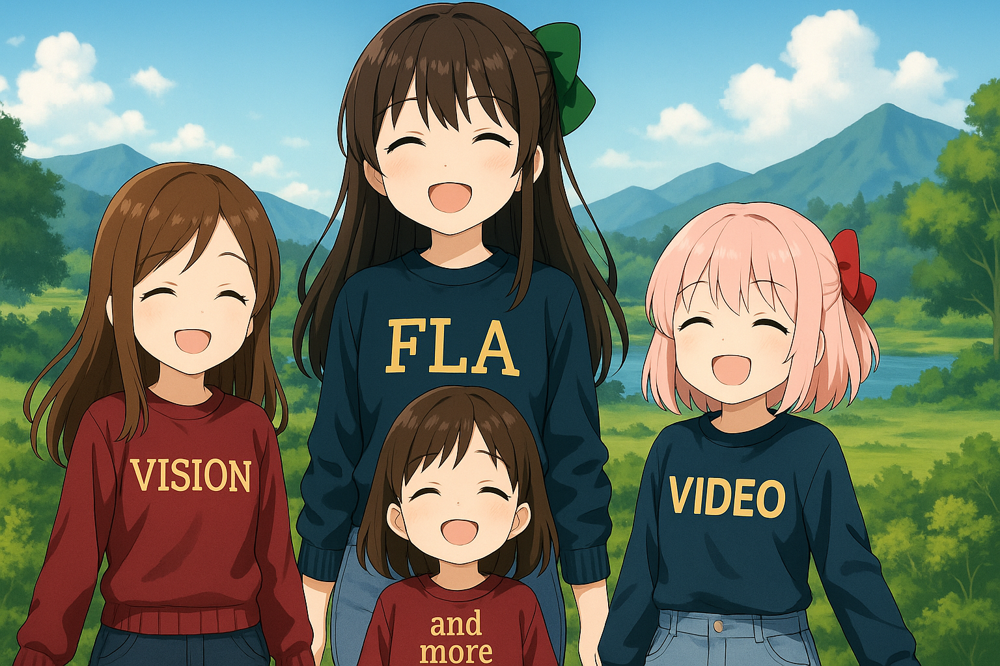

<div align="center">

# 🦁 FLA-Zoo: FLA models beyond language

[](https://github.com/fla-org/fla-zoo/stargazers)
[](https://github.com/fla-org/fla-zoo/network/members)
[](https://github.com/fla-org/fla-zoo/issues)

<p align="center">
  <b>A collection of FLA models extending beyond language</b>
</p>

<p align="center">
  Supporting vision, video, and more with efficient kernels mainly from <strong>fla-org</strong>
</p>

</div>

<div align="center">
  
  <!-- <em>[ai generated image with modifications]</em> -->
</div>

<p align="center">
  <a href="#news">News 📰</a> •
  <a href="#features">Features ✨</a> •
  <a href="#installation">Installation 🔧</a> •
  <a href="#getting-started">Getting Started 🚀</a>
</p>

<!-- * [Citation](#citation) -->

## News
- **[2025-04-23]** **A dedicated part of this repo: `flazoo/linearized_models` is created to store the linearized versions of your favorite transformers.**

- **[2025-04-21]** A dedicated part of this repo: `flazoo/helpers` is created to provide some common utils.

- **[2025-04-03]** MoBA is included as part of the collection for sparse attention. You can use it in specific layers of FLA models or directly use its full-blown models. Use hidden size which is multiple of 32 for MoBA.

- **[2025-03-16]** Native Sparse Attention (NSA) for vision is now added. See the triton implementation under the hood [here](https://github.com/fla-org/native-sparse-attention) and its visual variant [here](https://github.com/fla-org/fla-zoo/blob/main/flazoo/models/attentions.py).

- **[2025-03-02]** A pilot version of Native Sparse Attention (NSA) is added. More experiments should be conducted to test its performance.

- **[2025-02-23]** Add LightNet for classification. Also, a pilot SFT training script for vision models is added, check it out in [here](examples/vision/sft.py).

- **[2025-02-20]** Experiments evaluating the performance of vision models are in progress.

- **[2025-01-25]** This repo is created with some vision encoders.

## Features

### Understanding Models

| Domain | Status | Docs |
|--------|--------|---------------|
| **`vision`** | ✅ Available | [Doc](docs/vision/vision.md) |
| **`video`** | ✅ Available | 🔜 Coming soon |
| **`audio`** | 🔜 Coming soon | 🔜 Coming soon |

### Generation Models

| Domain | Status | Docs |
|--------|--------|---------------|
| **`c2i`** | 🔜 Coming soon | 🔜 Coming soon |
| **`t2i`** | 🔜 Coming soon | 🔜 Coming soon |
| **`t2v`** | 🔜 Coming soon | 🔜 Coming soon |

### Multi-modal Models

| Domain | Status | Docs |
|--------|--------|---------------|
| **`vlm`** | 🔜 Coming soon | 🔜 Coming soon |

## Installation

### Requirements

- Python 3.10+
- PyTorch 2.5+
- All dependencies from [flash-linear-attention](https://github.com/fla-org/flash-linear-attention?tab=readme-ov-file#installation)
- [torchvision](https://github.com/pytorch/vision)
- [diffusers](https://github.com/huggingface/diffusers)

### Quick Install

For people who just want to use base linear or hybrid model, basical dependencies below are enough.

```bash
# Create and activate conda environment
conda create -n flazoo python=3.12
conda activate flazoo

# Install PyTorch and related packages
pip install torch==2.6.0 torchvision==0.21.0 accelerate diffusers timm pytorchvideo

# Install transformer-related packages
pip install transformers datasets evaluate causal_conv1d einops scikit-learn wandb

# Install flash-attention
pip install flash-attn --no-build-isolation

# Install Hugging Face Hub CLI
pip install -U "huggingface_hub[cli]"

# Install FLA-Zoo in development mode
pip install -e .
```

Some repos are needed if you want to go deeper. Below is a basic example illustrating how to install MoBA.

```bash
# clone and install MoBA
git clone https://github.com/MoonshotAI/MoBA
cd MoBA
pip install .
```

Below is a table of these repos and what they are used for in `fla-zoo`.

| Repo | Link | Used for |
|------|------|----------|
| MoBA | [link](https://github.com/MoonshotAI/MoBA) | Sparse hybrid |
| REPA | [link](https://github.com/sihyun-yu/REPA) | Gen2D training |

> 💡 **Note:** As an actively developed repository, no released packages of `fla-zoo` are currently provided. Use `pip install -e .` to install the package in development mode.

Now we can start cooking! 🚀


## Getting Started

### Basic Usage

```python
from flazoo import DeltaNetVisionConfig, DeltaNetForImageClassification

# Initialize a configuration
config = DeltaNetVisionConfig()

# Initialize a model
model = DeltaNetForImageClassification(config)

# use it for whatever you like

```

### Read the Documentation

See the [documentation](docs/vision/vision.md) for more details on how to use the models and their configurations.
